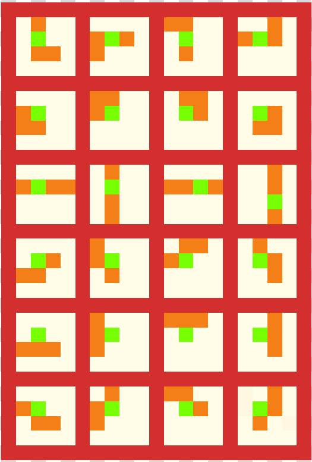

# SuperTetris
## Table of contents
* [General info](#general-info)
* [Shapes implemented](#Shapes-implemented)
* [Setup](#setup)

## General info
Tetris game with scores stored in database

## Technologies
Project is created with:
* Java 15
* Maven 11
* JavaFX 15.0.1

## Shapes implemented


## Setup
To run this project, install it locally using maven:

```
maven javafx:run -f pom.xml
```
